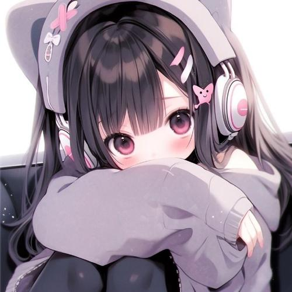

# Classify your album！
你是否为手机相册中存储了太多群友发的色图而不知所措？这个项目旨在**运用深度学习技术**帮你完成相册的初步分类！无论是聊天截图还是你的自拍（~~和群友的色图~~）都会被粗筛到不同的文件夹内，免去一个一个整理照片的苦恼

> [!WARNING]
>
> 基于深度学习技术的分类不可能达到百分百的准确，在使用本项目前请不要对准确率保有过高的预期！
## 环境要求
python版本为3.8.20，相关的库依赖主要有pytorch与numpy等，与python版本兼容即可

## 运行方法
设置好`make_dataset.py` `train_model.py` `classify.py`中设置好符合你要求的相关路径与超参数后，在项目路径下使用指令`./pipeline_all.sh`即可

## 代码说明
### Step1 获取数据集
为了免去复杂的手工标注，本项目选择从百度爬取目标图片。需要人工设置你需要爬取的不同样例目标（动漫图片，人像，风景……）并给出不同的标签（与后续的训练与推理相关）。

随后，程序会从百度请求搜索结果（例如“动漫”），并将动漫图片的搜索结果按照比例随机作为train/test/val数据集的一部分保存，并在对应的gt文件夹内生成该数据的标签:

### Step2 训练模型
项目采用Resnet18作为分类网络，你可以根据自由调整训练的epoch来达到更好的效果，或是修改代码中的优化器，超参数，甚至更换分类网络。

### Step3 对相册做分类
既然我们已经训练好了网络的权重，我们就可以使用这个权重对我们的目标文件夹进行分类了。

请将src文件夹设置为你保存图片的文件夹（其中应该包含待分类的xxx.jpg图片）；target文件夹设置为你希望保存到的目标路径（应该为空）。项目会按照其类别标签扔到对应的文件夹下（例如，假如动漫标签为1，目标会被复制到/target/1/ 下）。在程序运行结束之后，你就应该可以得到一个已经粗筛过的文件夹target。

## 已知的不足
当动漫图像与其他类别（例如人像自拍）过于相似的时候，容易产生误分类：

这两张图片被错误地分到了同一类（人像类）当中，或许是卡通人物居中导致该图片与人像类过于相似（二次元人像也是人像）~~这一切都是长期素食导致的~~

## 总结
本项目仅为娱乐开发的产物，代码质量不能够保证，望见谅。如果你对本项目有任何疑问或者想要提出改进，欢迎通过PR或Issue提出问题！